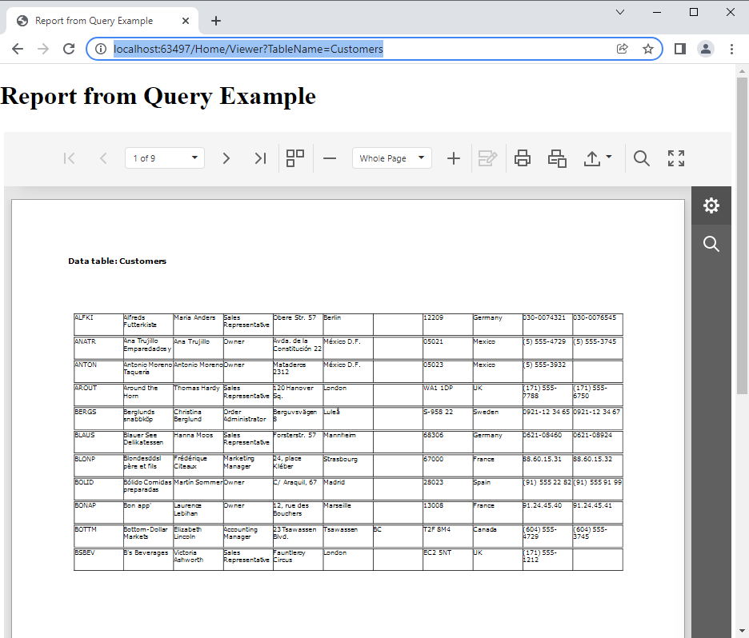

<!-- default badges list -->

<!-- default badges end -->
# Reporting for WebForms - How to Dynamically Generate a Report for a Table or Query

This example demonstrates how to use the Web Document Viewer to display the results of the SQL query in the form of a report. The data source query name is specified in the URL query string.

In this example the [XRTable](https://docs.devexpress.com/XtraReports/DevExpress.XtraReports.UI.XRTable) control in a report is created at runtime based on the query results. The query is created at runtime for the specified table. The user specifies the table name in the URL query string. 

In the XtraReport code-behind, the [SqlDataSource](https://docs.devexpress.com/CoreLibraries/DevExpress.DataAccess.Sql.SqlDataSource) instance is created and populated with data retrieved from the SQL query. The XRTable control is created in code, with table cells bound to the data table columns.

The project uses the SQLite database with Northwind data.

<!-- default file list -->

## Files to Look At

- [HomeController.cs](CS/ReportForQueryExample/Controllers/HomeController.cs) ([HomeController.vb](VB/ReportForQueryExample/Controllers/HomeController.vb))
- [TestReport.cs](CS/ReportForQueryExample/PredefinedReports/TestReport.cs) ([TestReport.vb](VB/ReportForQueryExample/PredefinedReports/TestReport.vb))

<!-- default file list end -->

## Documentation

- [Create Reports in Code](https://docs.devexpress.com/XtraReports/115726/detailed-guide-to-devexpress-reporting/reporting-api/create-reports-in-code)
- [Bind a Report to a Microsoft SQL Server Database at Runtime](https://docs.devexpress.com/XtraReports/4793/detailed-guide-to-devexpress-reporting/bind-reports-to-data/sql-database/bind-a-report-to-a-microsoft-sql-server-database-runtime-sample)
- [Standard .NET Providers](https://docs.devexpress.com/XtraReports/1181/detailed-guide-to-devexpress-reporting/bind-reports-to-data/standard-net-data-providers)
- [ASP.NET MVC Reporting](https://docs.devexpress.com/XtraReports/400247/web-reporting/asp-net-mvc-reporting)

## More Examples

- [How to Generate a Report at Runtime in an ASP.NET MVC Application](https://github.com/DevExpress-Examples/reporting-create-report-at-runtime-aspnet-mvc)

<!-- feedback -->
## Does this example address your development requirements/objectives?

 

(you will be redirected to DevExpress.com to submit your response)
<!-- feedback end -->
